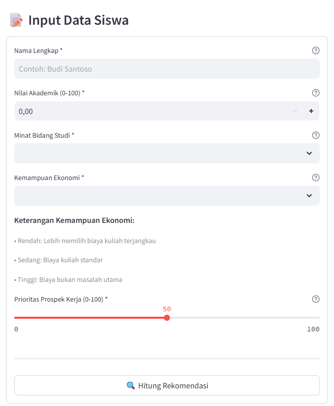
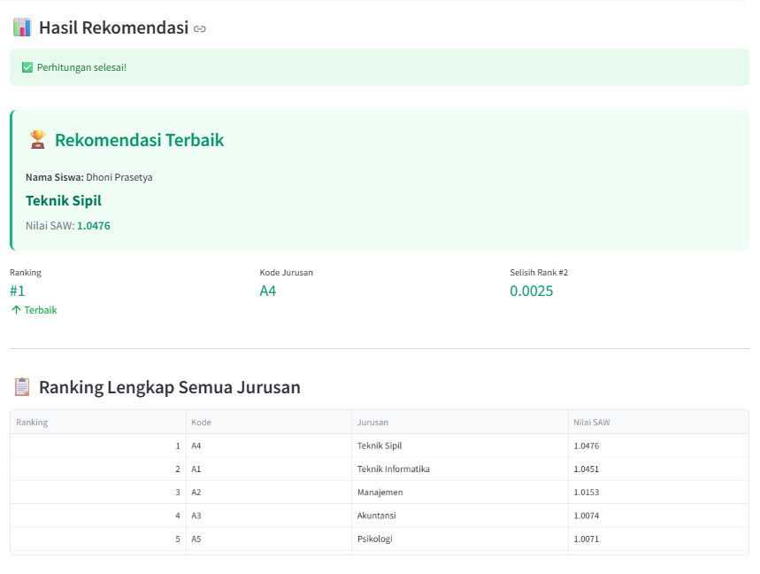

# 🎓 Sistem Pendukung Keputusan Pemilihan Jurusan

Aplikasi web berbasis Streamlit untuk membantu siswa memilih jurusan kuliah yang tepat menggunakan metode SAW (Simple Additive Weighting).

## 📋 Daftar Isi
- [Tentang Project](#tentang-project)
- [Fitur Utama](#fitur-utama)
- [Teknologi yang Digunakan](#teknologi-yang-digunakan)
- [Instalasi](#instalasi)
- [Cara Menjalankan](#cara-menjalankan)
- [Struktur Project](#struktur-project)
- [Metode SAW](#metode-saw)
- [Kriteria Penilaian](#kriteria-penilaian)
- [Screenshot](#screenshot)
- [Troubleshooting](#troubleshooting)
- [Pengembangan Lebih Lanjut](#pengembangan-lebih-lanjut)
- [Kontributor](#kontributor)
- [Lisensi](#lisensi)

---

## 🎯 Tentang Project

Project ini merupakan implementasi Sistem Pendukung Keputusan (SPK) untuk membantu siswa SMA/SMK dalam memilih jurusan kuliah yang sesuai dengan profil mereka. Aplikasi menggunakan metode **SAW (Simple Additive Weighting)** untuk menghitung dan meranking 5 pilihan jurusan berdasarkan 4 kriteria utama.

**Dibuat untuk:** Mata Kuliah Sistem Pendukung Keputusan  
**Metode:** SAW (Simple Additive Weighting)  
**Bahasa Pemrograman:** Python 3.8+  
**Framework:** Streamlit

---

## ✨ Fitur Utama

- ✅ **Form Input Interaktif** - Interface yang user-friendly untuk input data siswa
- ✅ **Perhitungan SAW Otomatis** - Algoritma SAW yang akurat dan cepat
- ✅ **Ranking Jurusan** - Menampilkan ranking 5 jurusan terbaik
- ✅ **Visualisasi Data** - Bar chart untuk perbandingan nilai SAW
- ✅ **Detail Perhitungan** - Menampilkan detail normalisasi setiap kriteria
- ✅ **Export ke CSV** - Download hasil rekomendasi dan detail perhitungan
- ✅ **Responsive Design** - Tampilan yang responsif di berbagai ukuran layar
- ✅ **Sidebar Informasi** - Info lengkap tentang metode dan kriteria

---

## 🛠️ Teknologi yang Digunakan

| Teknologi | Versi | Kegunaan |
|-----------|-------|----------|
| Python | 3.8+ | Bahasa pemrograman utama |
| Streamlit | 1.32.0 | Framework web app |
| Pandas | 2.2.0 | Manipulasi data |
| Matplotlib | 3.8.2 | Visualisasi grafik |
| NumPy | 1.26.3 | Komputasi numerik |

---

## 📥 Instalasi

### Prasyarat
- Python 3.8 atau lebih baru
- pip (Python package manager)
- VS Code (atau text editor lain)

### Langkah Instalasi

1. **Clone atau Download Project**
   ```bash
   # Jika menggunakan Git
   git clone https://github.com/username/spk-jurusan.git
   cd spk-jurusan

   # Atau download ZIP dan extract
   ```

2. **Buat Virtual Environment (Opsional tapi Direkomendasikan)**
   ```bash
   # Windows
   python -m venv venv
   venv\Scripts\activate

   # Linux/Mac
   python3 -m venv venv
   source venv/bin/activate
   ```

3. **Install Dependencies**
   ```bash
   pip install -r requirements.txt
   ```

4. **Verifikasi Instalasi**
   ```bash
   streamlit --version
   ```

---

## 🚀 Cara Menjalankan

### Menjalankan Aplikasi

1. **Buka Terminal di folder project**
   ```bash
   cd SPK-Jurusan
   ```

2. **Jalankan Streamlit**
   ```bash
   streamlit run app.py
   ```

3. **Buka Browser**
   - Aplikasi akan otomatis terbuka di `http://localhost:8501`
   - Jika tidak, buka browser dan akses URL tersebut

4. **Stop Aplikasi**
   - Tekan `Ctrl + C` di terminal

### Menjalankan di Port Lain

```bash
streamlit run app.py --server.port 8502
```

---

## 📁 Struktur Project

```
SPK-Jurusan/
│
├── app.py                      # File utama aplikasi Streamlit
│
├── data/
│   └── jurusan_data.py        # Data jurusan dan bobot kriteria
│
├── utils/
│   └── saw_calculator.py      # Logic perhitungan SAW
│
├── requirements.txt            # Daftar library yang dibutuhkan
│
├── README.md                   # Dokumentasi project (file ini)
│
└── assets/                     # Folder untuk gambar/file tambahan
    └── style.css              # CSS custom (opsional)
```

### Penjelasan File

| File | Deskripsi |
|------|-----------|
| `app.py` | File utama yang berisi UI dan flow aplikasi |
| `data/jurusan_data.py` | Berisi data master jurusan dan konfigurasi bobot |
| `utils/saw_calculator.py` | Berisi semua fungsi perhitungan SAW |
| `requirements.txt` | Daftar semua library Python yang dibutuhkan |
| `README.md` | Dokumentasi lengkap project |

---

## 📊 Metode SAW

### Apa itu SAW?

**SAW (Simple Additive Weighting)** adalah metode penjumlahan terbobot yang mencari penjumlahan terbobot dari rating kinerja pada setiap alternatif pada semua atribut.

### Langkah-Langkah SAW

1. **Menentukan Kriteria dan Bobot**
   - Identifikasi kriteria yang akan digunakan
   - Tentukan bobot untuk setiap kriteria (total = 100%)

2. **Normalisasi Matriks Keputusan**
   - **Benefit (Max):** `Rij = Xij / Max(Xij)`
   - **Cost (Min):** `Rij = Min(Xij) / Xij`

3. **Menghitung Nilai Preferensi**
   ```
   Vi = Σ (Wj × Rij)
   ```
   Di mana:
   - `Vi` = Nilai preferensi untuk alternatif i
   - `Wj` = Bobot kriteria j
   - `Rij` = Rating kinerja ternormalisasi

4. **Ranking**
   - Alternatif dengan nilai Vi tertinggi adalah yang terbaik

### Contoh Perhitungan

**Input Siswa:**
- Nilai Akademik: 85
- Minat: IPA
- Ekonomi: Sedang
- Prospek Kerja: 90

**Untuk Teknik Informatika:**

1. **R1 (Nilai Akademik)** = 85/85 = 1.000
2. **R2 (Minat)** = IPA cocok = 1.000
3. **R3 (Ekonomi)** = 70/100 = 0.700 (biaya tinggi)
4. **R4 (Prospek)** = 90/100 = 0.900

**Nilai SAW:**
```
V = (0.30 × 1.000) + (0.35 × 1.000) + (0.20 × 0.700) + (0.15 × 0.900)
V = 0.300 + 0.350 + 0.140 + 0.135
V = 0.925
```

---

## 🎯 Kriteria Penilaian

### 1. Nilai Akademik (Bobot: 30%)
- **Tipe:** Benefit (semakin tinggi semakin baik)
- **Satuan:** 0-100
- **Deskripsi:** Rata-rata nilai rapor atau ijazah siswa

### 2. Minat Bidang Studi (Bobot: 35%)
- **Tipe:** Benefit
- **Pilihan:** IPA, IPS, Seni
- **Deskripsi:** Kesesuaian minat siswa dengan jurusan
- **Scoring:**
  - Minat cocok = 1.0
  - Minat tidak cocok = 0.6

### 3. Kemampuan Ekonomi (Bobot: 20%)
- **Tipe:** Cost (semakin rendah biaya semakin baik)
- **Pilihan:** Rendah, Sedang, Tinggi
- **Deskripsi:** Kemampuan keluarga dalam membiayai kuliah

### 4. Prospek Kerja (Bobot: 15%)
- **Tipe:** Benefit
- **Satuan:** 0-100
- **Deskripsi:** Seberapa penting prospek kerja dalam memilih jurusan

### Alternatif Jurusan

| Kode | Nama Jurusan | Nilai Standar | Minat | Biaya | Prospek |
|------|-------------|---------------|-------|-------|---------|
| A1 | Teknik Informatika | 85 | IPA | Tinggi | 95 |
| A2 | Manajemen | 75 | IPS | Sedang | 80 |
| A3 | Akuntansi | 78 | IPS | Sedang | 85 |
| A4 | Teknik Sipil | 80 | IPA | Tinggi | 82 |
| A5 | Psikologi | 76 | Seni | Sedang | 78 |

---

## 📸 Screenshot

### Tampilan Form Input


### Hasil Rekomendasi


### Visualisasi Chart


---

## 🔧 Troubleshooting

### Error: "streamlit not found"
**Solusi:**
```bash
pip install --upgrade streamlit
```

### Error: "No module named 'data'"
**Solusi:**
Pastikan kamu menjalankan `streamlit run app.py` dari root folder project (SPK-Jurusan/)

### Error: "Port 8501 already in use"
**Solusi:**
```bash
# Gunakan port lain
streamlit run app.py --server.port 8502

# Atau kill process yang menggunakan port 8501
# Windows
netstat -ano | findstr :8501
taskkill /PID <PID> /F

# Linux/Mac
lsof -ti:8501 | xargs kill -9
```

### Aplikasi Lambat
**Solusi:**
- Clear cache Streamlit: Tekan `C` di browser
- Restart aplikasi: `Ctrl+C` lalu jalankan ulang
- Check RAM dan CPU usage

### Import Error
**Solusi:**
```bash
# Install ulang semua dependencies
pip install -r requirements.txt --force-reinstall
```

---

## 🚀 Pengembangan Lebih Lanjut

### Fitur yang Bisa Ditambahkan

#### 1. Database & Persistence
- [ ] Integrasi dengan SQLite/MySQL
- [ ] Simpan history perhitungan
- [ ] User authentication
- [ ] CRUD data jurusan via admin panel

#### 2. Multi-User Features
- [ ] Input batch (multiple siswa sekaligus)
- [ ] Komparasi hasil beberapa siswa
- [ ] Export ke Excel dengan formatting

#### 3. Customization
- [ ] Edit bobot kriteria via UI
- [ ] Tambah/hapus jurusan dinamis
- [ ] Tambah kriteria baru
- [ ] Import data dari file CSV/Excel

#### 4. Advanced Analytics
- [ ] Dashboard statistik
- [ ] Trend analysis
- [ ] Report generation (PDF)
- [ ] Visualisasi advanced (plotly, charts.js)

#### 5. UX Improvements
- [ ] Dark mode toggle
- [ ] Multi-language support
- [ ] Responsive mobile view
- [ ] Tutorial/onboarding untuk user baru

### Cara Kontribusi

1. Fork repository ini
2. Buat branch baru (`git checkout -b feature/AmazingFeature`)
3. Commit changes (`git commit -m 'Add some AmazingFeature'`)
4. Push ke branch (`git push origin feature/AmazingFeature`)
5. Buat Pull Request

---

## 👨‍💻 Kontributor

- **[Dhoni Prasetya]** - Developer Utama
- **[Not Found]** - Supervisor

---

## 📝 Lisensi

Project ini dibuat untuk keperluan akademis (Mata Kuliah Sistem Pendukung Keputusan).

Silakan gunakan dan modifikasi sesuai kebutuhan pembelajaran.

---

## 📞 Kontak

Jika ada pertanyaan atau saran, hubungi:

- **Email:** dhoniprasetya3@gmail.com
- **GitHub:** [@14112240028](https://github.com/1412240028)
- **LinkedIn:** [Dhoni Prasetya](https://www.linkedin.com/in/dhoni-prasetya-049980347/)

---

## 🙏 Acknowledgments

- Terima kasih kepada dosen pembimbing
- Streamlit community untuk dokumentasi yang lengkap
- Semua referensi yang digunakan dalam project ini

---

**⭐ Jangan lupa beri star jika project ini membantu kamu!**

*Last Updated: Desember 2024*